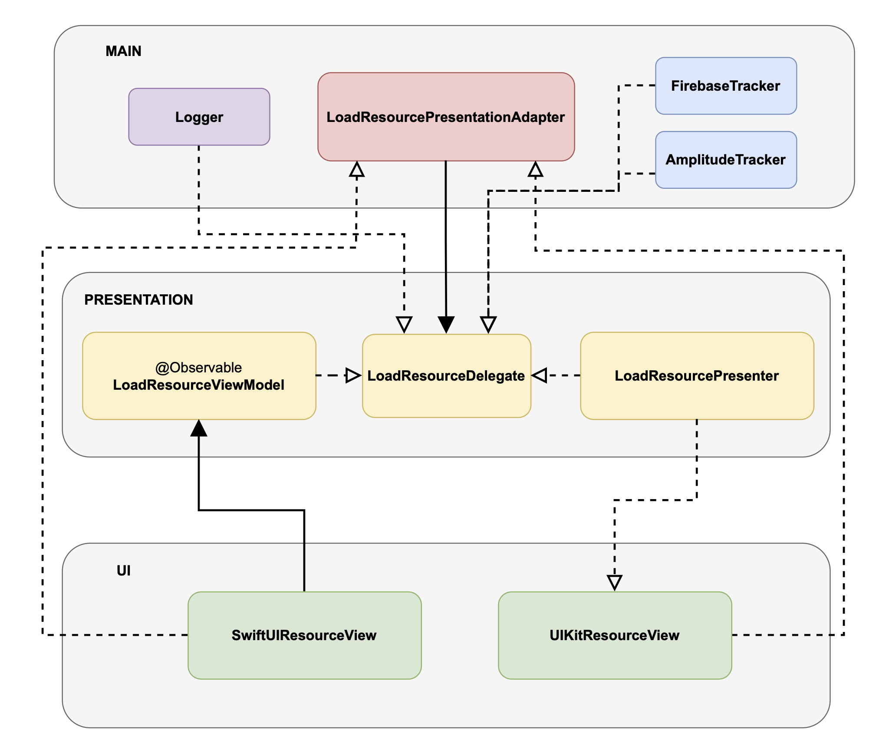

# 📚 Documentation: SOLID Analysis of `LoadResource` Code

---

## 1. 🔍 Code Overview

This code defines a clean, modular architecture for asynchronously loading resources. It separates:

- 🚀 Loading logic (`LoadResourcePresentationAdapter`)
- 🎨 UI state and presentation (`LoadResourcePresenter` or `LoadResourceViewModel`)
- 🔗 Communication between components via the `LoadResourceDelegate` protocol

---

## 2. 🧩 SOLID Principles Breakdown

### S — Single Responsibility Principle (SRP)  
**Rule:** A class should have one and only one reason to change.

- `LoadResourcePresentationAdapter` is solely responsible for coordinating loading and preventing concurrent calls.
- `LoadResourcePresenter` and `LoadResourceViewModel` manage the presentation state for the UI.
- The `LoadResourceDelegate` protocol defines the notification contract.

**✅ Benefit:** Clear separation of concerns, easy to maintain and test.

---

### O — Open/Closed Principle (OCP)  
**Rule:** Open for extension, closed for modification.

- The code is designed for easy extension (e.g., different views, mappers, resource types) without altering existing components.
- The injected mapper enables behavior customization.

**✅ Benefit:** Highly extensible design.

---

### L — Liskov Substitution Principle (LSP)  
**Rule:** Subtypes must be replaceable for their base types without breaking the app.

- All implementations of `LoadResourceDelegate` follow the expected contract.
- The system works seamlessly with any conforming View, ViewModel, or Presenter.

**✅ Benefit:** Flexibility and interchangeable components.

---

### I — Interface Segregation Principle (ISP)  
**Rule:** Interfaces should be minimal and client-specific.

- The `LoadResourceDelegate` protocol only defines what's needed for resource loading feedback.

**✅ Benefit:** Clean, targeted protocol with no unnecessary methods.

---

### D — Dependency Inversion Principle (DIP)  
**Rule:** Depend on abstractions, not concrete implementations.

- `LoadResourcePresentationAdapter` depends on abstract `Loader` and `LoadResourceDelegate` types.
- Concrete implementations are injected at runtime.

**✅ Benefit:** Decoupled design and high testability.

---

## 3. 🌟 Design Advantages

- **🧱 High modularity** – well-separated responsibilities.
- **🎛️ Flexible** – easily swap UI components or backends.
- **🧪 Testable** – all components are easily mockable.
- **🧪 Super easy to test** – since everything is driven by interfaces and has no side effects.
- **🚀 Safe async coordination** – via Swift `Task`.
- **🔒 Concurrency protection** – using `isLoading` inside the adapter.
- **💡 SwiftUI friendly** – thanks to `@Observable` ViewModel.

---

## 4. ⚠️ Potential Drawbacks

- **🧠 Requires good architectural understanding** to extend correctly.
- **⏳ No built-in cancellation or retry logic** in the adapter.
- **💥 Only basic protection against concurrent calls** (via a simple flag).

---

## 5. 🤔 Who manages `isLoading`?

| Component                         | Responsibility                                                      |
|----------------------------------|----------------------------------------------------------------------|
| `LoadResourcePresentationAdapter` | 🔒 Prevents concurrent loading (internal `isLoading`, not UI-bound)  |
| `LoadResourcePresenter` / `ViewModel` | 👁️ Controls what's displayed to the user (loading state, errors, etc.) |

**📌 Conclusion:**  
The adapter doesn't manage what the user sees.  
It only **protects the integrity of the loading process**.  
**The Presenter or ViewModel is in charge of updating the UI state.**

✅ No UI elements or frameworks are coupled to the loading logic, making this pattern perfectly portable across platforms like iOS, macOS, watchOS, or even server-side Swift.

💡 This decoupling enables you to swap or reuse presentation logic without rewriting the business or networking layer. Great for shared architecture in multi-platform apps!

---

## 6. 📊 SOLID Summary Table

| SOLID Principle               | Respected | Notes                                                             |
|------------------------------|-----------|-------------------------------------------------------------------|
| Single Responsibility         | ✅        | Each class has a clear, focused purpose                          |
| Open/Closed                  | ✅        | System can be extended with minimal changes                      |
| Liskov Substitution          | ✅        | Delegates are fully swappable                                    |
| Interface Segregation        | ✅        | Protocol is minimal and precise                                  |
| Dependency Inversion         | ✅        | Core logic depends on abstractions                               |

---

# Diagram:


# [Project GitHub here](https://github.com/Kylt4/RickAndMorty/tree/modular)

```swift
public protocol LoadResourceDelegate {
    associatedtype Item

    func didStartLoading()
    func didFinishLoading(with error: Error)
    func didFinishLoading(with item: Item)
}
```

```swift
public final class LoadResourcePresentationAdapter<L: Loader, Delegate: LoadResourceDelegate> where L.Item == Delegate.Item {
    private let loader: L
    private let delegate: Delegate

    private var isLoading = false

    public init(loader: L, delegate: Delegate) {
        self.loader = loader
        self.delegate = delegate
    }

    public func load() {
        guard !isLoading else { return }

        delegate.didStartLoading()
        isLoading = true

        Task {
            defer { isLoading = false }

            do {
                let item = try await loader.load()
                delegate.didFinishLoading(with: item)
            } catch {
                delegate.didFinishLoading(with: error)
            }
        }
    }
}

```

```swift
@Observable
final public class LoadResourceViewModel<Resource, PresentationModel>: LoadResourceDelegate {
    public typealias Item = Resource
    
    public var isLoading = false
    public var errorMessage: String? = nil
    public var item: PresentationModel? = nil

    public let mapper: (Resource) throws -> PresentationModel

    public init(mapper: @escaping (Resource) throws -> PresentationModel) {
        self.mapper = mapper
    }

    public func didStartLoading() {
        isLoading = true
        errorMessage = nil
    }

    public func didFinishLoading(with resource: Resource) {
        do {
            item = try mapper(resource)
            isLoading = false
        } catch {
            didFinishLoading(with: error)
        }
    }

    public func didFinishLoading(with error: Error) {
        isLoading = false
        errorMessage = SharedStringsHelper.loadError
    }
}
```

```swift
public protocol ResourceView {
    associatedtype ResourcePresentationModel

    func display(errorMessage: String?)
    func display(isLoading: Bool)
    func display(presentationModel: ResourcePresentationModel)
}

public final class LoadResourcePresenter<Resource, View: ResourceView>: LoadResourceDelegate {
    public typealias Item = Resource
    
    private let view: View
    private let mapper: (Resource) throws -> View.ResourcePresentationModel

    public init(view: View, mapper: @escaping (Resource) throws -> View.ResourcePresentationModel) {
        self.view = view
        self.mapper = mapper
    }

    public func didStartLoading() {
        view.display(errorMessage: nil)
        view.display(isLoading: true)
    }

    public func didFinishLoading(with resource: Resource) {
        do {
            view.display(presentationModel: try mapper(resource))
            view.display(isLoading: false)
        } catch {
            didFinishLoading(with: error)
        }
    }

    public func didFinishLoading(with error: Error) {
        view.display(errorMessage: SharedStringsHelper.loadError)
        view.display(isLoading: false)
    }
}

```
