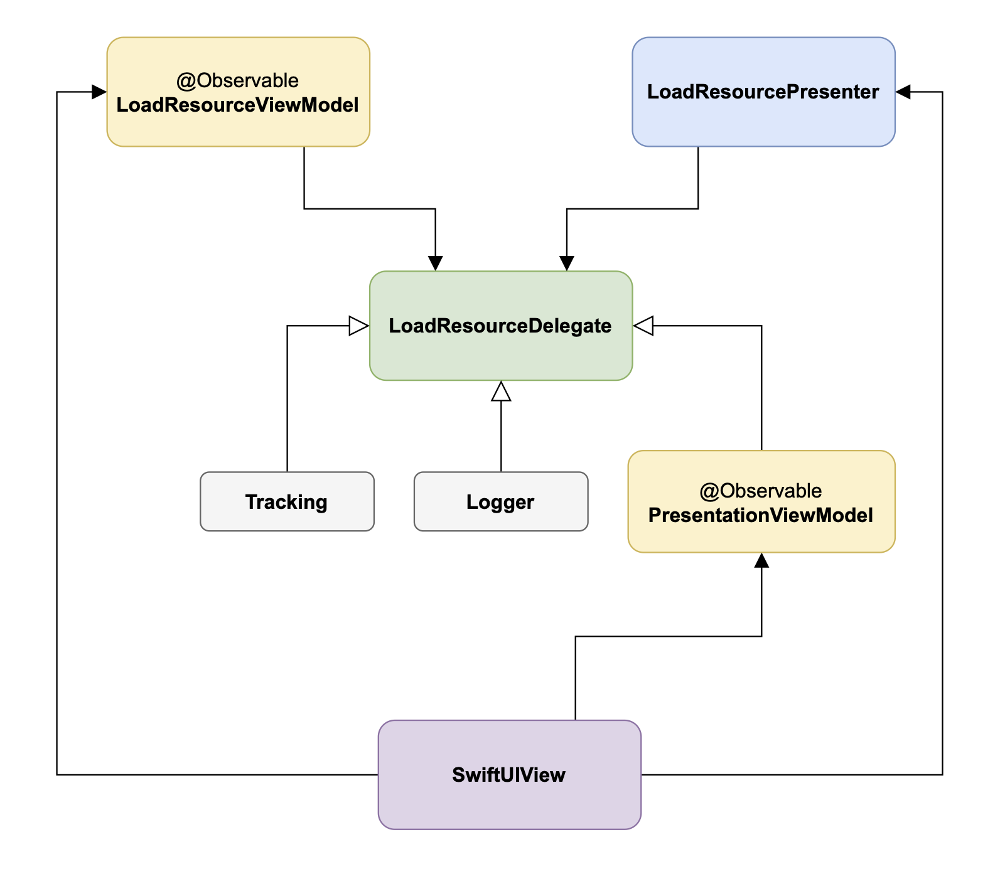

# SOLID Analysis of `LoadResourcePresenter`

### ✅ Patterns Used
- MVP (Model-View-Presenter)  
- Strategy (via injected mapper)  
- Generics (for flexibility and reuse)  

---

### ❌✅ SOLID Principles

| Principle                   | Status          | Explanation                                                                                  |
|-----------------------------|-----------------|----------------------------------------------------------------------------------------------|
| **S - Single Responsibility** | ❌ Violated     | Class handles both loading and mapping of data → two separate responsibilities combined. This violation makes testing more complex and the code harder to maintain.      |
| **O - Open/Closed**           | ✅ Respected    | Mapping logic is injected via mapper, allowing behavior change without modifying the class.   |
| **L - Liskov Substitution**   | ✅ Respected    | No violation of substitution principle with generics and interfaces used.                     |
| **I - Interface Segregation** | ✅ Respected    | Interfaces (Loader and LoadResourceDelegate) are focused and well-segregated.                 |
| **D - Dependency Inversion**  | ✅ Respected    | Depends on abstractions, and direct use of Task is consistent with its async responsibility. |

---

### ✅ Final summary
- **Violated**: SRP, due to combining loading and mapping responsibilities. This makes tests harder to write and maintain, and increases code complexity.  
- **Respected**: OCP, since behavior can be extended by providing different mappers without changing the class.  
- **Respected**: L, I, and D principles by proper use of generics, abstractions, and dependencies.

-


# SOLID Analysis of `LoadResourceViewModel`

### ✅ Patterns Used  
- MVVM (Model-View-ViewModel) with observable state (`@Observable`)  
- Strategy (via injected `mapper`)  
- Generics (for reusability across loaders and delegates)  
- Concurrency / Threading: Delegate callbacks dispatched on background threads (`Task.detached`) to avoid blocking the main thread  

---

### ❌✅ SOLID Principles

| Principle                   | Status          | Explanation                                                                                  |
|-----------------------------|-----------------|----------------------------------------------------------------------------------------------|
| **S - Single Responsibility** | ❌ Violated     | Combines loading, mapping, state management, delegate notifications, and threading. This violation makes tests harder to write and maintain, and increases code complexity. |
| **O - Open/Closed**           | ✅ Respected    | Mapping logic is injected, allowing extension without modifying the class itself.             |
| **L - Liskov Substitution**   | ✅ Respected    | No violations; generics and interfaces respect substitution principle.                        |
| **I - Interface Segregation** | ✅ Respected    | Delegate interface is focused and exposes only necessary callbacks.                          |
| **D - Dependency Inversion**  | ✅ Respected    | Depends on abstractions (`Loader` and `LoadResourceDelegate`); async tasks align with responsibilities. |

---

### ✅ Final summary
- **Violated**: SRP, due to combining loading, mapping, state management, delegate notifications, and threading responsibilities. This makes tests harder to write and maintain, and increases code complexity.  
- **Respected**: OCP, since behavior can be extended by providing different mappers without changing the class.  
- **Respected**: L, I, and D principles by proper use of generics, abstractions, and dependencies.

--

# Comparative Analysis: `LoadResourcePresenter` vs `LoadResourceViewModel`

| Aspect                    | LoadResourcePresenter                                   | LoadResourceViewModel                                                   |
|---------------------------|--------------------------------------------------------|------------------------------------------------------------------------|
| **Architectural Pattern**  | MVP (Model-View-Presenter)                             | MVVM (Model-View-ViewModel)                                            |
| **Responsibilities**      | Loading + Mapping                                     | Loading + Mapping + State Management + Delegate Notifications + Threading |
| **Threading**             | Threading **handled by caller (e.g., main thread)** → no internal threading logic, lighter class | Uses `Task.detached` to dispatch delegate callbacks off main thread to avoid UI blocking |
| **Observable State**      | None                                                  | Uses `@Observable` to expose `isLoading`, `item`, and `error`          |
| **Tracking Layer**         | Tracking is abstracted and injected via the delegate   | Must add an explicit mapping layer in ViewModel despite abstraction in Presenter |
| **SOLID - SRP**           | ❌ Violated: loading and mapping combined             | ❌ Violated: loading, mapping, tracking, state & threading combined               |
| **SOLID - OCP**           | ✅ Respected: behavior extensible via injected mapper  | ✅ Respected: same as presenter                                        |
| **SOLID - LSP**           | ✅ Respected                                           | ✅ Respected                                                          |
| **SOLID - ISP**           | ✅ Respected: focused interfaces                        | ✅ Respected                                                          |
| **SOLID - DIP**           | ✅ Respected                                           | ✅ Respected                                                          |
| **Concurrency Handling**  | Lightweight, assumes caller manages threading          | Explicit internal threading to protect main thread                    |
| **Complexity**            | Simple, focused on flow and mapping                     | More complex: handles state & threading besides loading              |
| **Extensibility**         | Good, via generics and injected dependencies           | Good, with added reactive state support                               |
| **Use Case**              | Best if caller manages threading and UI state separately | Best for reactive UI frameworks needing internal state management     |

---

## Summary of Advantages & Disadvantages

| Class                   | Advantages                                                                 | Disadvantages                                                   |
|-------------------------|----------------------------------------------------------------------------|-----------------------------------------------------------------|
| **LoadResourcePresenter** | - Simple and easy to understand<br>- Delegates threading to caller (less internal complexity)<br>- Clear separation of loading and mapping via delegate | - No explicit UI state management<br>- SRP violated by mixing loading & mapping |
| **LoadResourceViewModel** | - Exposes observable state for UI binding<br>- Internal threading to avoid blocking main thread<br>- Handles errors and loading state internally<br>- Requires explicit mapping layer despite abstraction in presenter | - More complex and harder to maintain<br>- SRP violated by mixing multiple concerns<br>- Threading logic coupled with loading and mapping |

# Diagram:



# [Project GitHub here](https://github.com/Kylt4/RickAndMorty/tree/classic)

```swift
public protocol LoadResourceDelegate {
    associatedtype PresentationModel

    func didStartLoading()
    func didFinishLoading(with error: Error)
    func didFinishLoading(with item: PresentationModel)
}
```

```swift
public final class LoadResourcePresenter<L: Loader, View: LoadResourceDelegate> {
    private let loader: L
    private let view: View
    private let mapper: (L.Item) throws -> View.PresentationModel

    private var isLoading = false

    public init(loader: L, view: View, mapper: @escaping (L.Item) throws -> View.PresentationModel) {
        self.loader = loader
        self.view = view
        self.mapper = mapper
    }

    public init(loader: L, view: View) where L.Item == View.PresentationModel {
        self.loader = loader
        self.view = view
        self.mapper = { $0 }
    }

    public func load() {
        guard !isLoading else { return }

        view.didStartLoading()
        isLoading = true

        Task {
            defer { isLoading = false }

            do {
                let item = try await loader.load()
                view.didFinishLoading(with: try mapper(item))
            } catch {
                view.didFinishLoading(with: error)
            }
        }
    }
}
```

```swift
@Observable
public final class LoadResourceViewModel<L: Loader, Delegate: LoadResourceDelegate> {
    private let loader: L
    private let delegate: Delegate
    private let mapper: (L.Item) throws -> Delegate.PresentationModel

    public var isLoading = false
    public var item: Delegate.PresentationModel?
    public var error: Error?

    public init(loader: L, delegate: Delegate, mapper: @escaping (L.Item) throws -> Delegate.PresentationModel) {
        self.loader = loader
        self.delegate = delegate
        self.mapper = mapper
    }

    public init(loader: L, delegate: Delegate) where L.Item == Delegate.PresentationModel {
        self.loader = loader
        self.delegate = delegate
        self.mapper = { $0 }
    }

    @MainActor
    public func load() async {
        guard !isLoading else { return }
        defer { isLoading = false }

        let delegate = delegate
        let mapper = mapper
        
        Task.detached { delegate.didStartLoading() }
        isLoading = true
        error = nil

        do {
            let item = try mapper(await loader.load())
            self.item = item
            Task.detached { delegate.didFinishLoading(with: item) }
        } catch let receivedError {
            error = receivedError
            Task.detached { delegate.didFinishLoading(with: receivedError) }
        }
    }
}
```
